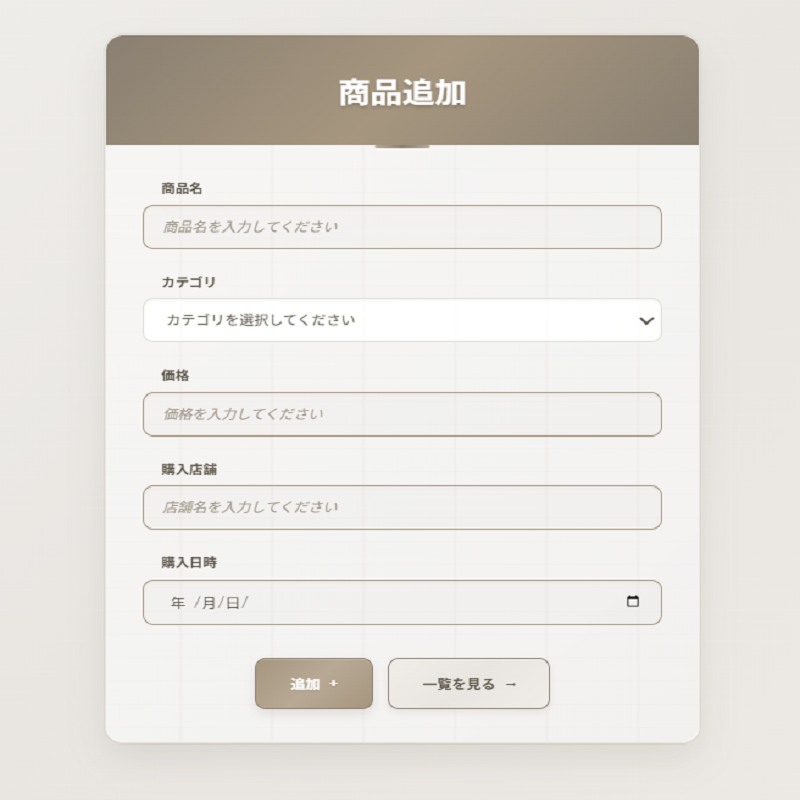

# 物価比較アプリ Ssada!


## 概要

複数の店舗で販売されている商品の価格を比較し、ユーザーが最も安い価格を簡単に把握できるようにするWebアプリケーションです。  
日常の節約や買い物の効率化を目的として開発しました。

このアプリの設計・実装には、ChatGPT、Claudを活用しました。  
コードの理解や構成の補助として利用しながら、自分自身で動作確認・修正を繰り返し仕上げました。

アプリ名の「Ssada!」は、韓国語で「安い!」という意味の言葉です。  
身近な買い物に役立つこのアプリに、親しみやすさと韓国語にまつわるつながりを込めて名付けました。


## デモ
-アプリホーム画面


-商品追加画面



-登録商品一覧画面


-価格一覧画面（最安値確認）


## 主な機能

- 商品の登録・編集・削除
- 店舗ごとの価格登録
- 価格一覧の表示と最安値の視覚的な強調
- 商品情報のカテゴリ絞り込み（任意）

## ディレクトリ構成

```bash
cd ./src
tree /f

├─main
│  ├─java
│  │  └─com
│  │      └─example
│  │          └─price_comparison
│  │              │  PriceComparisonApplication.java
│  │              │
│  │              ├─controller
│  │              │      PriceInfoController.java
│  │              │      ProductController.java
│  │              │
│  │              ├─entity
│  │              │      PriceInfo.java
│  │              │      Product.java
│  │              │      Store.java
│  │              │
│  │              ├─enums
│  │              │      Category.java
│  │              │
│  │              └─repository
│  │                      PriceInfoRepository.java
│  │                      ProductRepository.java
│  │                      StoreRepository.java
│  │
│  └─resources
│      │  application.properties
│      │
│      ├─static
│      │  └─css
│      │          add.css
│      │          home.css
│      │          list.css
│      │          table.css
│      │
│      └─templates
│          │  home.html
│          │
│          └─products
│                  add.html
│                  list.html
│                  table.html
│
└─test
    └─java
        └─com
            └─example
                └─price_comparison
                        PriceComparisonApplicationTests.java
```

## 使用技術

### 言語・フレームワーク
- Java 21
- Spring Boot 3.5.0
- Thymeleaf（テンプレートエンジン）

### データベース
- H2 Database（ファイル永続化型）

### その他
- Spring Data JPA（ORM）
- Spring Web（MVC構成）
- Spring Boot DevTools（自動リロード）
- Maven（ビルド・依存管理）
